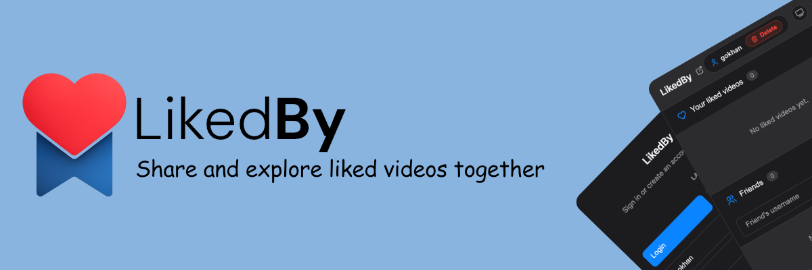

<br />

<div align="center">
  
</div>

<!-- <div align="center">
  
</div> -->

# LikedBy

Track your YouTube likes and see which videos your friends liked.

## What is LikedBy?

LikedBy is a Chrome browser extension that tracks like and unlike actions on YouTube and shows friend activity on the video page. It runs entirely in the browser, is not a hosted SaaS, and is controlled by the user who installs it.

## Features

- Tracks like and unlike events on YouTube videos and Shorts.
- Avoids false “unlike” events by reacting only to real state transitions.
- Import and export liked videos as JSON from the popup.
- Uses a PIN-based login flow with hashed PINs.

## Installation

This extension is installed manually from this repository.

1. Clone or download this repository.
2. Copy `.env.example` to `.env` and fill in your Firebase client config values.
3. Open Chrome and go to `chrome://extensions/`.
4. Enable Developer Mode.
5. Click **Load unpacked**.
6. Select the repository root folder.

## Usage

- On YouTube watch pages and Shorts, the extension detects the like button state.
- When you like a video, it records the like for your account and updates counts.
- When you unlike, it removes your like record and updates counts.
- The popup lets you export your liked videos to JSON and import them later.

## Data & Privacy

Stored:

- Your username in `chrome.storage.local`.
- Liked video metadata and timestamps in Firestore.
- Friend relationships for showing who liked the current video.

Not stored:

- Full browsing history beyond liked YouTube videos tracked by the extension.

## Directory Structure

```
.
├── assets/
│   ├── icons/
│   └── likedby-logo.png
├── content/
│   ├── core.js
│   ├── ui.js
│   └── utils.js
├── lib/
├── popup/
│   ├── popup.html
│   ├── popup.js
│   ├── popup.css
│   ├── i18n.js
│   └── constants.js
├── background.js
├── manifest.json
├── .env.example
```

- `background.js`: Service worker that handles Firebase, auth, and data writes.
- `content/`: Content scripts that detect like state and render UI overlays on YouTube.
- `popup/`: Extension popup UI for login, friends, and import/export.
- `assets/`: Extension branding and icons.
- `lib/`: Firebase bundles (do not edit).
- `manifest.json`: Chrome extension manifest and permissions.
- `.env.example`: Firebase client config template.

## Development

- This project is plain JavaScript and runs without a build step.
- Use Chrome Developer Mode to load the unpacked extension.

## Support

If you find this useful, you can optionally support the project here:
[☕ Buy Me a Coffee](https://www.buymeacoffee.com/gkhntpbs)

## Contributing

- Keep changes focused and consistent with existing style.
- Avoid editing files under `lib/`.
- Test manually in Chrome before submitting changes.

## License

This project is licensed under the MIT License. See `LICENSE`.

_Note: This project was developed with the assistance of AI tools._
